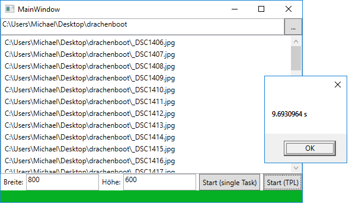

# Image Resizer
## Funktionsbeschreibung
Mit einer WPF Applikation sollen alle Bilddateien (Dateierweiterung `.jpg`oder `.jpeg`) auf eine
einzugebende Größe skaliert werden. Damit das Programm auch bei großen Ordnern schnell arbeitet,
soll dafür die TPL (Task Parallel Libary verwendet werden). Das vorgegebene Layout sieht so aus:


Eine Archiv mit 53 hoch aufgelösten Bildern (24 MP) befindet sich auf *\\\enterprise\ausbildung\unterricht\unterlagen\schletz\drachenboot.7z* (819 MB)

### UI Elemente
Der mit ... beschriftete Button öffnet den "Ordner wählen" Dialog des Betriebssystems. Dieser kann
in C# mit folgendem Code eingeblendet werden:
```C#
using (System.Windows.Forms.FolderBrowserDialog dialog =
    new System.Windows.Forms.FolderBrowserDialog())
{
    System.Windows.Forms.DialogResult result = dialog.ShowDialog();
    if (result == System.Windows.Forms.DialogResult.OK)
    {
        string result = dialog.SelectedPath;
    }
}
```
Das gewählte Verzeichnis wird dann in die Textbox links des Buttons geschrieben. Gleichzeitig werden
alle Bilddateien im gewählten Verzeichnis in die darunterstehende Liste geschrieben. Für das 
Suchen der Bilddateien gibt es im ViewModel eine fertige Methode `getImageFiles(string[] extensions)`.
Diese liefert eine Auflistung aller gefundenen Dateien als Collection von FileInfo Objekten zurück.
Das FileInfo Objekt wird zur Verwaltung der Dateinamen verwendet, da hier auf Pfad, Dateiname und Extension
separat zugegriffen werden kann.

Beim Klicken auf *Start (single Task)* soll mit der klassischen foreach Schleife ein Bild nach dem
anderen abgearbeitet werden. Am Ende soll die benötigte Zeit ausgegeben werden. Dies kann mit folgendem
Code geschehen:
```C#
DateTime start = DateTime.Now;
/* Do hard work */
MessageBox.Show((DateTime.Now - start).TotalSeconds + " s");
```

## Adaptierung des ViewModels
Das Viewmodel ist nur als Gerüst vorgegeben. Die Properties, die für das Bindung in XAML verwendet
wurden, sind immer als Default Property eingegeben. Dies muss natürlich - wenn erforderlich - geändert
werden. Für die Umsetzung von Commands kann wieder die RelayCommand Klasse verwendet werden, die im
Musterprojekt auch enthalten ist.

Der Konvertierungsvorgang selbst kann mit der ebenfalls mitgelieferten Klasse ImageFile erledigt werden.
Folgender Beispielcode wandelt das Bild `C:\Bilder\meinBild.jpg` um und speichert es automatisch als `C:\Bilder\meinBild_600px.jpg`:
```C#
ImageFile imageFile = new ImageFile()  { SourceFile = new FileInfo(@"C:\Bilder\meinBild.jpg") };
imageFile.Width = 800;
imageFile.Height = 600;
imageFile.Quality = 80;
imageFile.Resize();            // Liefert true im Erfolgs- oder false im Fehlerfall.
```

Für die Parallelisierung der Konvertierung wähle die ForEach Methode der Parallel Klasse. Die Lambda
Expression beinhaltet den Code, der ausgeführt werden soll:
```C#
Parallel.ForEach(myList, listItem =>
{
    /* Do somewhat with listItem */
});
```

## Konfiguration des Visual Studio Projektes
Das Musterprojekt ist als 64bit Applikation konfiguriert. Durch die Parallelisierung
würde bei großen Bildern das Speicherlimit für eine 32bit Anwendung gesprengt werden. Achte daher,
dass bei CPU der Typ x64 gewählt wurde.

## Anhang 1: Die RelayCommand Klasse
```C#
using System;
using System.Windows.Input;

namespace ImageResizer
{
    /// <summary>
    /// Idee: Da die Command Klassen sich nur in der Execute Methode unterscheiden, geben wir sie
    /// einfach im Konstruktor mit.
    /// Diese Methode bekommt ein object als Parameter und gibt nichts zurück (void). Daher ist dies
    /// eine Instanz des generischen Action<object> Delegates.
    /// </summary>
    class RelayCommand : ICommand
    {
        private Action<object> execMethod;                // Wird in Exec aufgerufen.
        private Func<object, bool> canExecMethod;
        public event EventHandler CanExecuteChanged;
        /// <summary>
        /// Setzt die Methode, die in Exec aufgerufen werden soll.
        /// </summary>
        /// <param name="execMethod">Eine (anonyme) Methode, die ein object als Parameter
        /// bekommt und nichts zurückgibt.</param>
        public RelayCommand(Action<object> execMethod) : this(execMethod, null)
        { }
        public RelayCommand(Action<object> execMethod, Func<object, bool> canExecMethod)
        {
            // Ist die execMethod null, wird nichts gemacht.
            this.execMethod = execMethod ?? (o => { });
            // Ist die canExecMethod null, dann wird eine Methode verwendet, die immer true liefert.
            this.canExecMethod = canExecMethod ?? (o => true);
        }
        public bool CanExecute(object parameter)
        {
            return canExecMethod(parameter);
        }

        public void Execute(object parameter)
        {
            execMethod(parameter);
        }
    }
}
```

## Anhang 2: Die ImageFile Klasse
```C#
using System;
using System.IO;
using System.Windows.Media.Imaging;
using System.Windows.Media;

namespace ImageResizer
{
    /// <summary>
    /// Bildbearbeitungsklasse für das Skalieren des Bildes.
    /// </summary>
    /// <example>
    /// ImageFile imageFile = new ImageFile() { SourceFile = new FileInfo(@"C:\Bilder\meinBild.jpg") };
    /// imageFile.Width = Width;
    /// imageFile.Height = Height;
    /// imageFile.Quality = 80;
    /// imageFile.Resize();
    /// </example>
    class ImageFile
    {
        /// <summary>
        /// Die Breite des skalierten Bildes.
        /// </summary>
        public int Width { get; set; }
        /// <summary>
        /// Die Höhe des skalierten Bildes.
        /// </summary>
        public int Height { get; set; }
        /// <summary>
        /// Die JPEG Qualität (1 bis 100)
        /// </summary>
        public int Quality { get; set; } = 80;
        /// <summary>
        /// Die Dateiinfo des Originalbildes.
        /// </summary>
        public FileInfo SourceFile { get; set; }
        /// <summary>
        /// Die Dateiinfo des skalierten Bildes. Hier wird an den Dateinamen _600px angehängt, wenn
        /// das Bild auf 600 Pixel breite skaliert werden soll.
        /// </summary>
        public FileInfo ResizedFile
        {
            get
            {
                return new FileInfo(SourceFile.FullName.Replace(SourceFile.Extension, "_" + Width + "px" + SourceFile.Extension));
            }
        }
        /// <summary>
        /// Führt die skalierung durch.
        /// </summary>
        /// <returns>true, wenn das Bild skaliert werden konnte. false bei Fehlern.</returns>
        public bool Resize()
        {
            bool success = true;
            try
            {
                /* Datei erstellen bzw, überschreiben, wenn sie schon existiert. */
                using (FileStream fs = new FileStream(ResizedFile.FullName, FileMode.Create))
                {
                    try
                    {
                        BitmapFrame source = BitmapFrame.Create(new Uri(SourceFile.FullName));
                        /* Das Bild proportional skalieren. */
                        double scaleFactor = Math.Min(1.0 * Width / source.PixelWidth, 1.0 * Height / source.PixelHeight);
                        TransformedBitmap tb = new TransformedBitmap(
                            source,
                            new ScaleTransform(scaleFactor, scaleFactor)
                        );
                        JpegBitmapEncoder encoder = new JpegBitmapEncoder();
                        encoder.QualityLevel = Quality;
                        encoder.Frames.Add(BitmapFrame.Create(tb));
                        encoder.Save(fs);
                    }
                    catch
                    {
                        success = false;
                    }
                }
            }
            catch
            {
                /* Bei Filesystem Fehlern (kein Zugriff möglich, keine Rechte, etc.) */
                success = false;
            }
            return success;
        }

    }
}

```
## Anhang 3: Der XAML Code des Layouts in MainWindow.xaml
```XML
<Window x:Class="ImageResizer.MainWindow"
        xmlns="http://schemas.microsoft.com/winfx/2006/xaml/presentation"
        xmlns:x="http://schemas.microsoft.com/winfx/2006/xaml"
        xmlns:d="http://schemas.microsoft.com/expression/blend/2008"
        xmlns:mc="http://schemas.openxmlformats.org/markup-compatibility/2006"
        xmlns:local="clr-namespace:ImageResizer"
        mc:Ignorable="d"
        Title="MainWindow" Height="350" Width="525">
    <Grid>
        <Grid.RowDefinitions>
            <RowDefinition Height="Auto" />
            <RowDefinition Height="*" />
            <RowDefinition Height="Auto" />
            <RowDefinition Height="Auto" />
        </Grid.RowDefinitions>
        <!-- Textfeld für das Verzeichnis und Suchbutton -->
        <Grid Grid.Row="0">
            <Grid.ColumnDefinitions>
                <ColumnDefinition Width="*" />
                <ColumnDefinition Width="Auto" />
            </Grid.ColumnDefinitions>
            <TextBox Text="{Binding Folder}"></TextBox>
            <Button Grid.Column="1" Content="..." Padding="5,5,5,5" Width="30" Command="{Binding SearchCommand}"></Button>
        </Grid>
        
        <!-- Listbox für die Bilddateien im gewählten Ordner -->
        <ListBox Grid.Row="1" ItemsSource="{Binding ImageFiles}" x:Name="lstFiles">
            <ListBox.ItemTemplate>
                <DataTemplate>
                    <TextBlock Text="{Binding FullName}" />
                </DataTemplate>
            </ListBox.ItemTemplate>
        </ListBox>
        
        <!-- Eingabezeile für Breite und Höhe sowie die Startbuttons -->
        <Grid Grid.Row="2">
            <Grid.ColumnDefinitions>
                <ColumnDefinition Width="Auto" />
                <ColumnDefinition Width="*" />
                <ColumnDefinition Width="Auto" />
                <ColumnDefinition Width="*" />
                <ColumnDefinition Width="Auto" />
                <ColumnDefinition Width="Auto" />
            </Grid.ColumnDefinitions>
            <Label Content="Breite:" Grid.Column="0"/>
            <TextBox Text="{Binding Width}" Grid.Column="1" />
            <Label Content="Höhe:" Grid.Column="2" />
            <TextBox Text="{Binding Height}" Grid.Column="3" />
            <Button Content="Start (single Task)" Command="{Binding StartSingleCommand}" Grid.Column="4" Padding="5,5,5,5" Margin="5,0,5,0"/>
            <Button Content="Start (TPL)" Command="{Binding StartTplCommand}" Grid.Column="5" Padding="5,5,5,5"/>
        </Grid>
        
        <!-- Progressbar für die aktuelle Konvertierung -->
        <ProgressBar Grid.Row="3" Minimum="0" Maximum="{Binding ImageCount}" Value="{Binding ProcessedImages}" Height="20"/>
    </Grid>
</Window>

```

## Anhang 4: Das Gerüst des ViewModels
```C#
/*
 * Benötigt eine Referenz auf System.Windows.Forms, sie muss mit References -> Add Reference hinzugefügt
 * werden. Den "Ordner suchen" Dialog gibt's nur dort.
 * 
 * Außerdem ist unter Build -> Configuration Manager bei Active Solution Platform mit <New...> die
 * x64 Architektur auszuwählen. Sonst gibt es bei einer 32bit App eine MemoryException wenn die
 * Bilder viel und groß sind.
 */
using System;
using System.Collections.Generic;
using System.ComponentModel;       // Für INotifyPropertyChanged
using System.Linq;
using System.Threading.Tasks;
using System.Windows.Input;        // Für ICommand
using System.IO;                   // Für die DirectoryInfo
using System.Windows;

namespace ImageResizer
{
    /// <summary>
    /// ViewModel für das ImageResize Tool. Nicht vergessen im MainWindow Konstruktor den 
    /// DataContext darauf zu setzen!
    /// </summary>
    class ImageResizerViewModel : INotifyPropertyChanged
    {
        public event PropertyChangedEventHandler PropertyChanged;

        /// <summary>
        /// Binding Property für das Textfeld mit dem Fotopfad.
        /// </summary>
        public string Folder { get; set; }


        /// <summary>
        /// Binding für das Textfeld mit der Bildbreite.
        /// </summary>
        public int Width { get; set; }
        /// <summary>
        /// Binding für das Textfeld mit der Bildhöhe.
        /// </summary>
        public int Height { get; set; }

        /// <summary>
        /// Binding für den Max Value der Progressbar.
        /// </summary>
        public int ImageCount { get; set; }
        /// <summary>
        /// Binding für den aktuellen Stand der Progressbar.
        /// </summary>
        public int ProcessedImages { get; set; }

        /// <summary>
        /// Binding für den Suchbutton. Hier wird der klassiche Windows Forms Ordner suchen 
        /// Dialog geöffnet und das Ergebnis in Folder geschrieben.
        /// </summary>
        public ICommand SearchCommand { get; }

        /// <summary>
        /// Binding für den Startbutton ohne TPL (einfach mit der foreach Schleife alle Dateien 
        /// nacheinander abarbeiten)
        /// </summary>
        public ICommand StartSingleCommand { get; }

        /// <summary>
        /// Binding für den Startbutton mit TPL. Hier wird mit Parallel.ForEach die Liste der
        /// Bilddateien durchgegangen und mit Tasks die Skalierung durchgeführt.
        /// </summary>
        public ICommand StartTplCommand { get; }

        /// <summary>
        /// Binding für die Listbox, die die gefundenen Dateien anzeigt.
        /// </summary>
        public IEnumerable<FileInfo> ImageFiles { get; set; }

        /// <summary>
        /// Liefert alle Dateien eines Ordners, die der Übergebenen Liste von Erweiterungen entsprechen.
        /// </summary>
        /// <param name="extensions">Array mit den Erweiterungen. Diese müssen mit . beginnen.</param>
        /// <returns>Liste aller gefundenen Dateien oder null im Fehlerfall.</returns>
        /// <example>
        /// ImageFiles = getImageFiles(new string[] { ".jpg", ".jpeg" })
        /// </example>
        private IEnumerable<FileInfo> getImageFiles(string[] extensions)
        {
            try
            {
                DirectoryInfo di = new DirectoryInfo(Folder);
                return di.EnumerateFiles().Where(fi => extensions.Any(e => e == fi.Extension));
            }
            catch
            {
                return null;
            }
        }
    }
}

```
